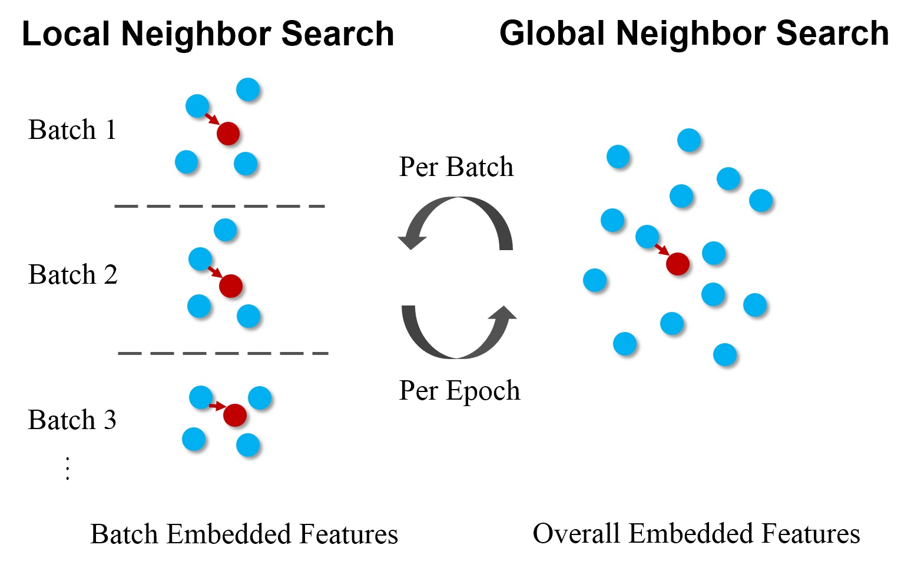
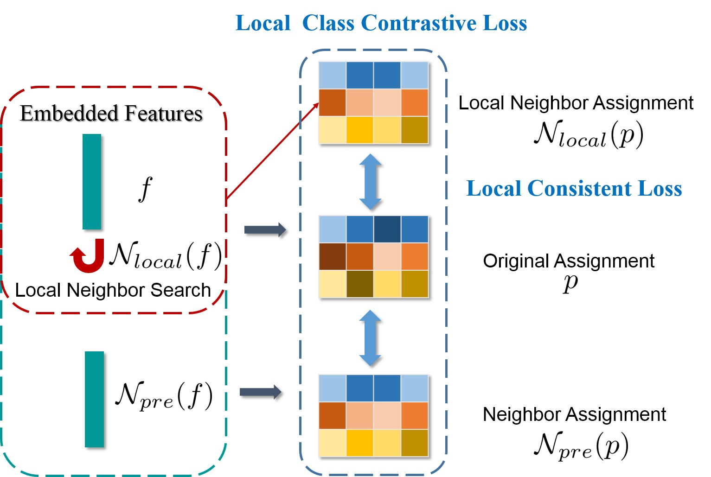
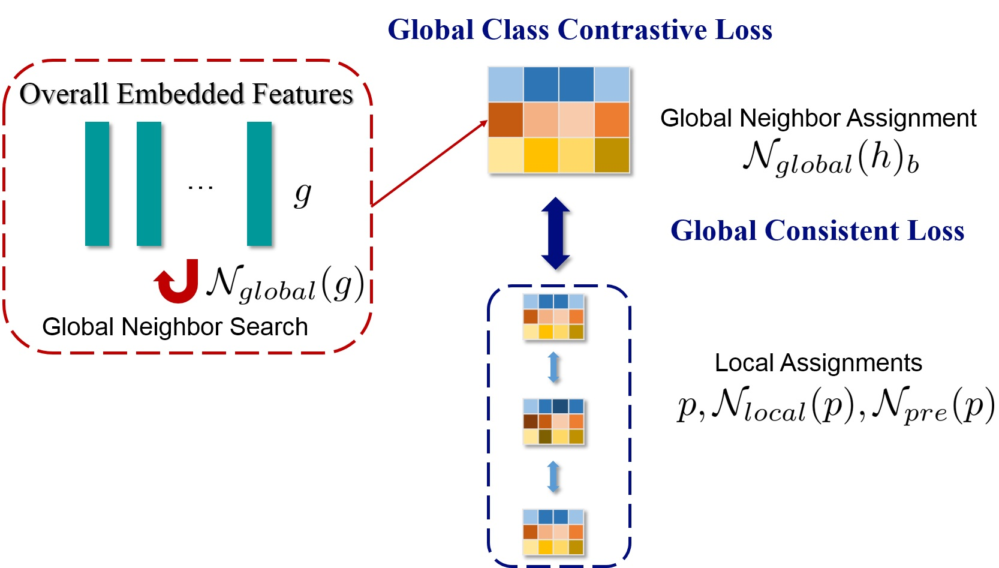
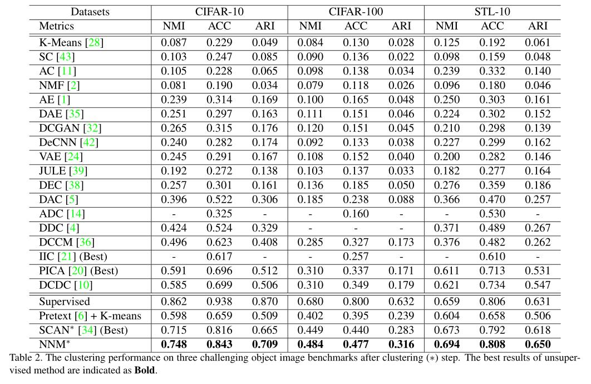
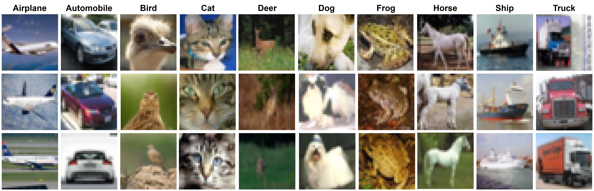

# NNM: Nearest Neighbor Matching for Deep Clustering.

Forked from SCAN (https://github.com/wvangansbeke/Unsupervised-Classification).

## Introduction




<p> The illustration of our idea. We propose to match more semantically nearest neighbors from between <b>local (batch)</b> and <b>global (overall)</b> level. Benefit from the dynamic updated deep features with iteration and epoch increases, we can construct more and more semantically confident sample pairs from samples and its neighbors. </p>

## Framework
Local Nearest Neighbor Matching



Global Nearest Neighbor Matching



For specifical loss, please refer [paper](./dzy-CVPR2021-NNM-final.pdf) and [poster](./4001-poster.pdf).

## Main Results



## Run
### Requirements
Python 3.7 and Pytorch 1.4.0 are required. Please refer to [requirements.yaml](./requirements.yaml) for more details.
### Usages

Clone this repo: `git clone https://github.com/ZhiyuanDang/NNM.git`.

Download datasets: [CIFAR-10/100](https://www.cs.toronto.edu/~kriz/cifar.html), [STL-10](http://ai.stanford.edu/~acoates/stl10/).

We can directly use the pre-text model from [SCAN](https://github.com/wvangansbeke/Unsupervised-Classification). Then, we only need to generate the neighbors by the code 

`python simclr.py --config_env configs/env.yml --config_exp configs/pretext/simclr_cifar10.yml`. 

Next, we run the clustering step: 

`python scan.py --config_env configs/env.yml --config_exp configs/scan/scan_cifar10.yml --gpus 0 --seed 1234`.

Visualizing the top-k images is easily done by setting the `--visualize_prototypes` flag. 

For example on cifar-10:
`python eval.py --config_exp configs/scan/scan_cifar10.yml --model $MODEL_PATH --visualize_prototypes`.

And the Top-3 images is:


However, due to issues in SCAN, self-label is not suitable for NNM. Thus, we remove this file.


## Citation
```
@inproceedings{dang2021nearest,
	title={Nearest Neighbor Matching for Deep Clustering},
	author={Dang, Zhiyuan and Deng, Cheng and Yang, Xu and Wei, Kun and Huang, Heng},
	booktitle={Proceedings of the IEEE/CVF Conference on Computer Vision and Pattern Recognition},
	year={2021}
}
```

## Reference

SpCL (https://github.com/yxgeee/SpCL)